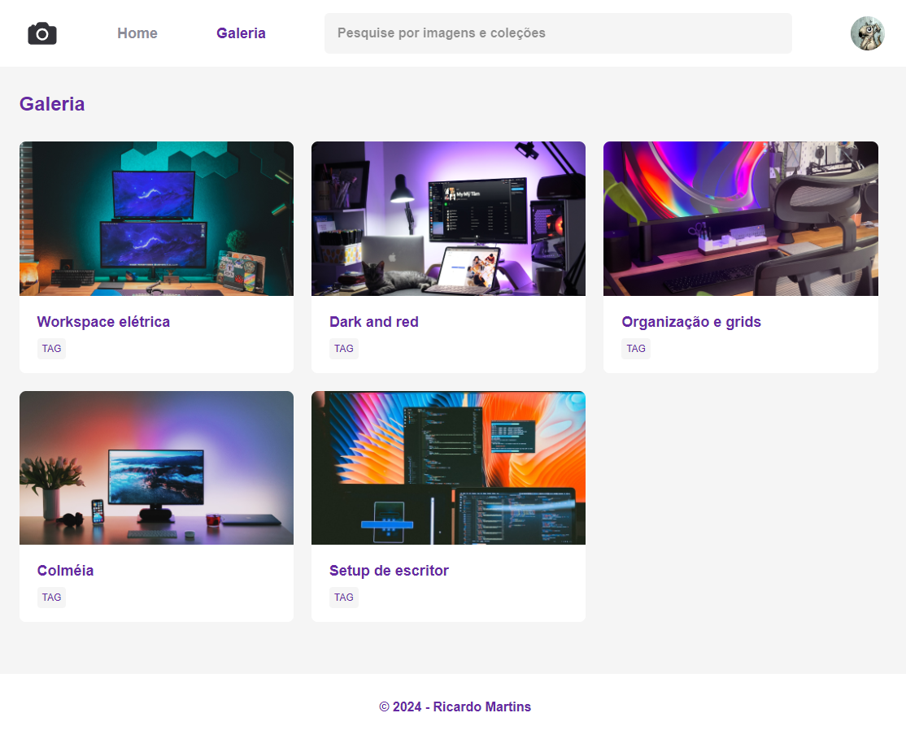

<h1 align="center"> Fundamentos HTML & CSS </h1>

Programa exclusivo do Explore, promovido pela Rocketseat para ensino de tecnologias WEB.  

  <a href="#-tecnologias">Tecnologias</a>&nbsp;&nbsp;&nbsp;|&nbsp;&nbsp;&nbsp;
  <a href="#-projeto">Projeto</a>&nbsp;&nbsp;&nbsp;|&nbsp;&nbsp;&nbsp;
  <a href="#-layout">Layout</a>&nbsp;&nbsp;&nbsp;|&nbsp;&nbsp;&nbsp;
  <a href="#memo-licença">Licença</a>

  

 

  

## 🚀 Tecnologias

Esse projeto foi desenvolvido com as seguintes tecnologias:

- HTML e CSS
- Git e Github

## 💻 Projeto

O projeto FotoBlog foi construído para o reforço para o estudo de grid e animações, reforçando os confeitos de css.

## 🔖 Layout

Você pode visualizar o layout do projeto através [DESSE LINK](https://www.figma.com/design/QgXnp9P7COUQRTkaOAQdNU/Fotoblog-%E2%80%A2-Projeto-Explorer-(Community)?m=auto&t=R8PIg8pmnDbHS6j7-6). É necessário ter conta no [Figma](https://figma.com) para acessá-lo.

## 📄 Licença

Esse projeto está sob a licença MIT.

---

Feito com ♥ by Ricardo Martins 